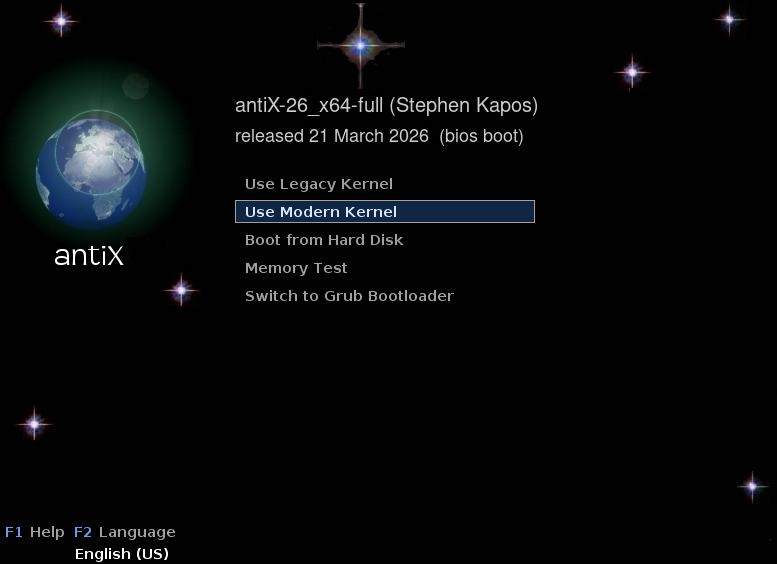
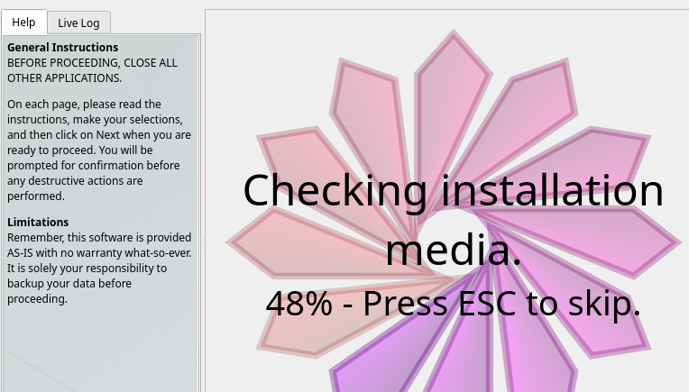
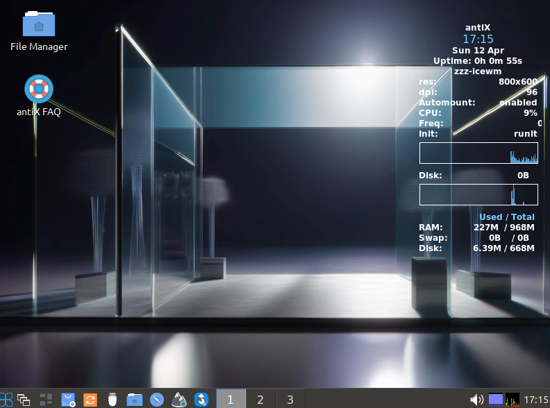
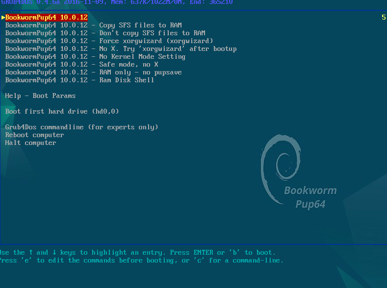
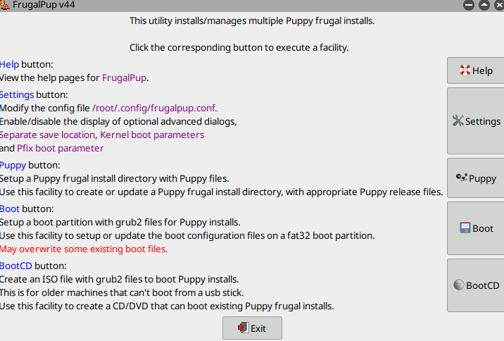
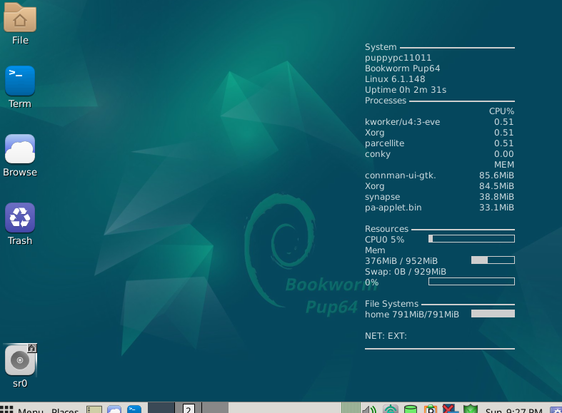
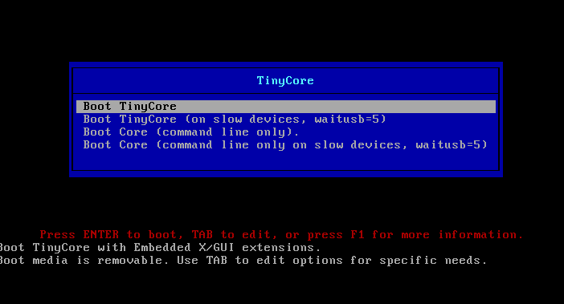
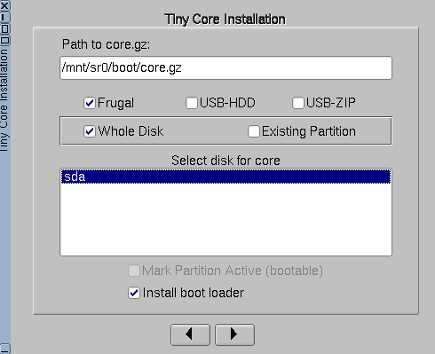
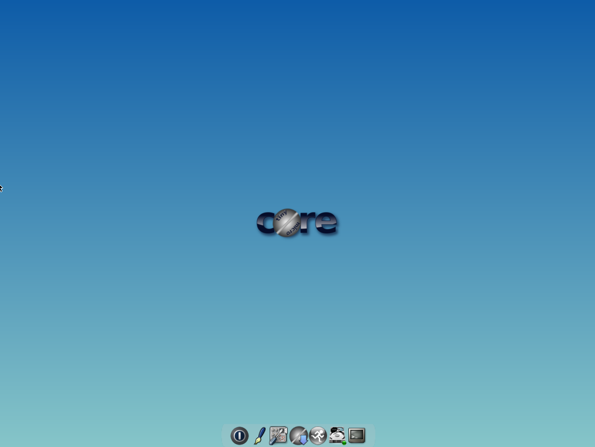

# ENTREGA ÚNICA · Reto 01

## 1. Portada

- Alumno/a: Jesús López Carrasco
- Grupo: 4
- Curso: 1 ASIR
- Fecha: 12/04/2026

## 2. Introducción

En la presente tarea se aborda el análisis y acondicionamiento de equipos heredados (legacy) en entornos educativos, tomando como caso práctico un HP Compaq dc7800. Dado el limitado hardware de este equipo (procesador Core 2 Duo, 1 GB de RAM DDR2 y almacenamiento HDD), el objetivo principal de este trabajo es identificar, justificar y probar mediante virtualización tres distribuciones GNU/Linux ligeras que permitan devolverle la operatividad. A través de este proceso se busca determinar la solución de software más viable para su uso en el aula taller, equilibrando el rendimiento del sistema con la utilidad práctica para los alumnos.

## 3. Análisis del equipo real

## 1. Identificación del equipo
- **Marca y modelo:** HP Compaq dc7800
- **Número o variante del equipo (si aparece):** SFF
- **Ubicación o identificación en el aula:**  Grupo 4

## 2. Procesador
- **Modelo de CPU:** Intel Core 2 Duo E6750 @ 2.66 GHz
- **Número de núcleos (si se conoce):**  2
- **Arquitectura observada o probable:**  64

## 3. Memoria RAM
- **Cantidad total instalada:** 1GB
- **Tipo de memoria (si se conoce):** DDR2

## 4. Almacenamiento
- **Tipo de unidad (HDD/SSD):** HDD
- **Capacidad:**  160GB
- **Observaciones:**  Modelo Barracuda

## 5. Arranque y firmware
- **¿Se ha observado BIOS o UEFI?:** BIOS
- **Observaciones del menú de arranque:** Cuando fallabas la contraseña 3 veces, entrabas en la bios sin necesidad de contraseña  
- **Comentarios sobre el particionado previsto:**  
## 4. Selección de las 3 ISOs

### 4.1 Criterios usados

**Distribucion 1:** Es una de las mejores distribuciones para hardware heredado porque prescinde de systemd. Al usar IceWM, ofrece un entorno visual basico y completo con un consumo de RAM minimo (menos de 200 MB en reposo), dejando casi todo el GB de memoria libre para las aplicaciones del usuario.

**Distribucion 2:** Su arquitectura es única: carga todo el sistema operativo en la memoria RAM al arrancar. Dado que el HP dc7800 tiene un disco duro mecánico antiguo (y lento), ejecutar Puppy Linux desde la RAM ignorará ese cuello de botella, permitiendo que las aplicaciones se abran casi al instante.

**Distribucion 3:** Es la expresión mínima de un sistema Linux. Si el equipo tuviera componentes dañados o la RAM fallara limitando aún más la capacidad, Tiny Core es capaz de arrancar en casi cualquier chatarra electrónica. Es un "salvavidas" absoluto.

### 4.2 Tabla comparativa

| ISO             | Versión            | Arquitectura | RAM mínima | Disco mínimo | Tamaño ISO | Ventajas                                                      | Inconvenientes                                      | Decisión   |
| ----------------- | --------------------- | -------------: | ------------: | --------------: | ------------: | --------------------------------------------------------------- | ----------------------------------------------------- | ------------- |
| antiXISO 01     | 23.1                |          x64 |      256 MB |          5 GB |      2,1 GB | Completa, lista para usar, ultraligera sin systemd.           | Interfaz anticuada, sin comandos systemd estándar. | Principal   |
| PuppyISO 02     | BookwormPup 10.0.12 |          x64 |      300 MB |         ~1 GB |      791 MB | Corre directamente en RAM, ultrarrápida frente a HDD lentos. | Sistema de guardado persistente algo confuso.       | Alternativa |
| Tiny CoreISO 03 | 15.0 CorePlus       |          x64 |      128 MB |         50 MB |       25 MB | Inmune a hardware obsoleto, consumo casi inexistente.         | Demasiado básica, requiere instalar todo a mano.   | Respaldo    |

## Resumen de la comparación

Tras analizar las características del HP Compaq dc7800, **antiX Linux se perfila como la opción principal (más equilibrada)** . Ofrece una experiencia de escritorio lista para usar nada más instalarse, con herramientas suficientes para una clase sin ahogar la memoria.

**Puppy Linux queda como una alternativa muy fuerte** gracias a su carga en RAM, ideal si comprobamos que el desgaste del disco duro mecánico hace inusable antiX. Finalmente, **Tiny Core se reserva como la opción de seguridad absoluta (respaldo)** ; si nada más funciona, Tiny Core arrancará sin dudarlo, aunque requerirá un mayor esfuerzo de configuración manual por parte del usuario

### 4.3 Ficha resumida de ISO 01
- Distribución: antiX Linux
- Versión: 23.1
- Motivo de elección:
- Papel dentro del plan: Opcion Principal

### 4.4 Ficha resumida de ISO 02
- Distribución: Puppy Linux
- Versión: BookwormPup64
- Motivo de elección:
- Papel dentro del plan: Alternativa

### 4.5 Ficha resumida de ISO 03
- Distribución: Tiny Core Linux
- Versión: 10.0.2
- Motivo de elección: Debian Base
- Papel dentro del plan: Respaldo

## 5. Configuración de la máquina virtual

## Software utilizado
- **Aplicación:**  Virtual Box
- **Versión:**  7.2.4

## Configuración aplicada
- **CPU:** 2
- **RAM:** 1GB
- **Disco virtual:** 45 GB 
- **Controlador de almacenamiento:** SATA
- **Red:** Quitada
- **Audio / vídeo / otros ajustes relevantes:** Arquitectura configurada como "Debian (64-bit)" 

## Relación con el equipo real

En esta máquina virtual se ha intentado simular fielmente el principal "cuello de botella" del equipo real: la limitación estricta de 1 GB de memoria RAM, así como la capacidad de procesamiento de 2 núcleos y su arquitectura de 64 bits.

## Observación importante

La máquina virtual sirve como **banco de pruebas previo**, pero no garantiza al 100 % el mismo comportamiento que el equipo real.

## 6. Resultados de las pruebas

### 6.1 ISO 01
- ¿Arranca? Si
- ¿Entra al instalador? Si
- ¿Se instala? Si
- ¿Arranca después? Si
- Incidencias: Ninguna
- Capturas:

### 6.2 ISO 02
- ¿Arranca? Si
- ¿Entra al instalador? Si
- ¿Se instala? Si
- ¿Arranca después? Si
- Incidencias: Ninguna
- Capturas:

### 6.3 ISO 03
- ¿Arranca? Si
- ¿Entra al instalador? Si
- ¿Se instala? Si
- ¿Arranca después? Si
- Incidencias: Ninguna
- Capturas:

## 7. Conclusión final

- antiX Linux (Opción Principal): La más equilibrada. Chupa poquísima RAM (porque no usa systemd) y ya viene con escritorio y herramientas para trabajar.

- Puppy Linux (Alternativa): Se ejecuta entera desde la memoria RAM. Te salva la vida si el disco duro del PC físico está muy desgastado y va lentísimo.

- Tiny Core Linux (Respaldo): El plan de emergencia. Consume una miseria (128 MB). Si el hardware está medio muerto, esto arranca seguro, pero viene "pelado" y hay que instalarle todo a mano.

## 8. Bibliografía

[Web Oficial ISO 1](https://antixlinux.com/)
[Web Oficial ISO 2](https://puppylinux-woof-ce.github.io/)
[Web Oficial ISO 3](http://tinycorelinux.net/faq.html)