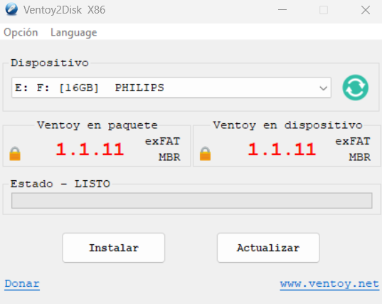
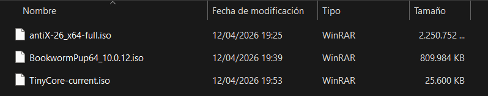

# Ficha · Preparación del USB con Ventoy

## 1. Datos básicos del pendrive
- Marca y modelo: Philips
- Capacidad: 16 GB
- Sistema desde el que se preparó: Windows 11

## 2. Preparación de Ventoy
- Programa utilizado: Ventoy
- Versión de Ventoy: 1.1.11
- Pasos seguidos para instalar Ventoy en el USB:
  1. Descargar el archivo de Ventoy para Windows desde su sitio oficial y descomprimir el contenido en una carpeta.
  2. Conectar el pendrive Philips de 16 GB al equipo y ejecutar la aplicación Ventoy2Disk.exe
  3. Asegurarse de seleccionar la unidad USB correcta en el menú desplegable "Device".
  4. Pulsar el botón "Install" (o "Instalar"), aceptando las advertencias de seguridad que indican que se borrarán todos los datos del dispositivo.
  5. Una vez instalado ventoy en el usb, arrastrar las 3 ISOs al usb.

## 3. Precauciones tomadas
- ¿Se comprobó que el USB correcto era el seleccionado? 

Sí, se verificó la letra y la capacidad de la unidad en el Explorador de Windows antes de proceder en el programa, para evitar formatear un disco del sistema por error.

- ¿Se hizo copia de seguridad de los datos del pendrive antes de formatearlo?

Sí, se revisó el contenido previo del pendrive y se respaldaron los archivos importantes en el disco local de Windows 11.

- ¿Se verificó que Ventoy quedó instalado correctamente?

Sí, el propio programa mostró un mensaje de éxito, y se pudo comprobar en la interfaz que la versión de Ventoy en el "Device" (dispositivo) coincidía con la del paquete.

## 4. Evidencias

- Captura o foto del proceso de instalación de Ventoy:

- Captura o foto del contenido del USB ya preparado:

- Observaciones: 

Las tres ISOs se copiaron en la raíz del USB sin necesidad de descomprimirlas, aprovechando el funcionamiento de arranque directo de Ventoy.

## 5. Valoración

La preparación del USB fue un proceso muy rápido y directo. La herramienta es muy intuitiva, detectó el pendrive a la primera y la instalación se completó en unos segundos. No surgió ninguna dificultad ni durante el formateo del dispositivo ni al transferir las imágenes ISO al USB. Todo funcionó exactamente como se esperaba.
