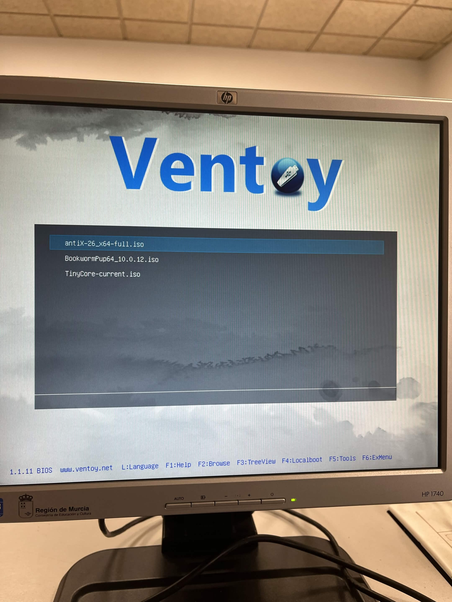

# Ficha · Relación de ISOs copiadas en el USB

## ISO 01

- Distribución: antiX Linux
- Versión: 26.1
- Nombre del archivo ISO: antiX-26_x64-full.iso
- Papel previsto: Principal

## ISO 02

- Distribución: Puppy Linux
- Versión: 10.0.12
- Nombre del archivo ISO: BookwormPup64_10.0.12.iso
- Papel previsto: Alternativa

## ISO 03

- Distribución: Tiny Core Linux
- Versión: 14.0
- Nombre del archivo ISO: TinyCore-current.iso
- Papel previsto: Respaldo

## Evidencias

- Captura del explorador mostrando las 3 ISOs copiadas:

- Captura del menú de Ventoy donde aparezcan las 3 ISOs:

