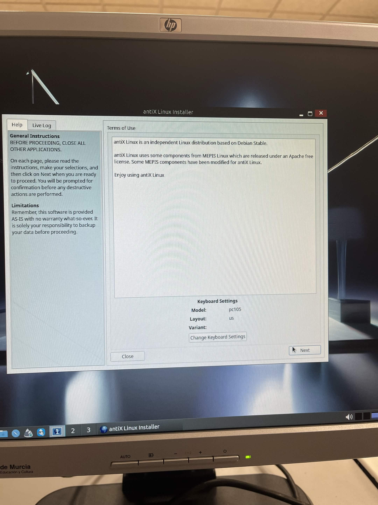

# Ficha · Intento de instalación 1

## 1. Datos básicos
- ISO utilizada: antiX Linux
- Fecha y hora aproximada: 16:25 21/04/2026
- Puesto dentro del plan: Principal

## 2. Arranque
- ¿Se seleccionó la ISO desde Ventoy?
Si
- ¿La ISO arrancó correctamente?
Si
- Evidencia: 

## 3. Instalación
- ¿Se llegó al instalador?
Si
  
- Tipo de instalación elegido: Instalación limpia usando todo el disco
- Esquema de particionado usado: Partición raíz / + partición swap
  
- Pasos principales realizados(TODOS LOS RELEVANTES):
  1. Normal Boot
  2. Elegir el disco donde instalar
  3. Configurar particion / + swap
  4. Configurar usuario y contraseña

## 4. Resultado del intento
- ¿La instalación finalizó correctamente? 
Si
- ¿El sistema arrancó después?
Si
- Estado final: 
Exito

## 5. Problemas encontrados
- Problema 1:
- Problema 2:
- Problema 3:

## 6. Soluciones aplicadas
- Solución 1:
- Solución 2:
- Solución 3:

## 7. Decisión tomada
Nos quedamos con esta ISO

## 8. Evidencias
- Captura de arranque:

- Captura del instalador:

- Captura del resultado final o del error:

