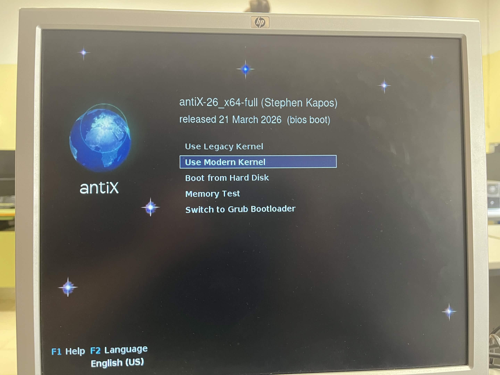
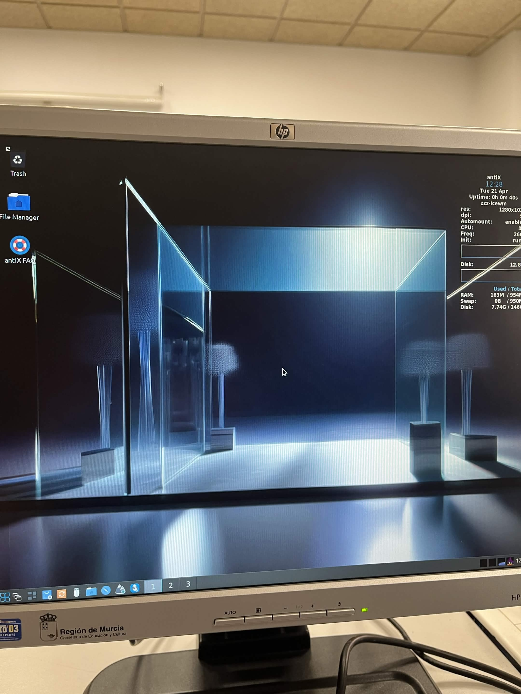

# Ficha · Registro general de la instalación

## 1. Datos de la sesión de trabajo
- Fecha: 21/04/2026
- Aula o taller: Taller
- Miembros del grupo: 4
- Equipo utilizado: HP Compaq dc7800

## 2. Preparación previa
- ¿El USB con Ventoy estaba listo? Si
- ¿Estaban copiadas las 3 ISOs? Si
- ¿Se sabía el orden de intento? Si

## 3. Arranque del equipo
- Tecla o método usado para seleccionar el arranque: F9
- ¿Entró correctamente en el menú de arranque? Si
- ¿Se detectó el USB? Si
- ¿Ventoy arrancó correctamente? Si

## 4. Resultado global
- ISO finalmente instalada: antiX Linux
- ¿La instalación terminó correctamente? Si
- ¿El sistema arranca después de instalar? Si
- Observaciones generales:

## 5. Evidencias clave
- Foto o captura del menú de arranque:

- Foto o captura del menú de Ventoy:

- Foto o captura del sistema ya instalado:

