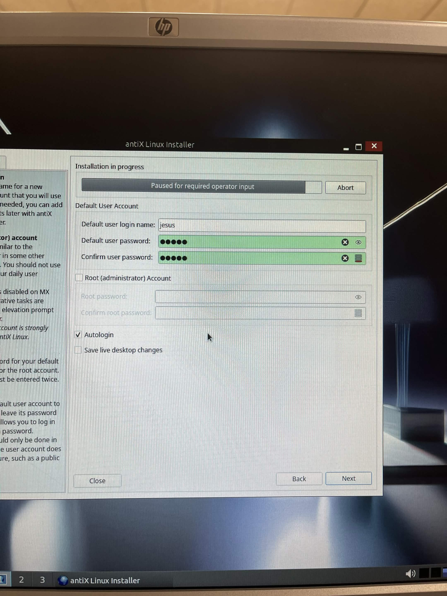
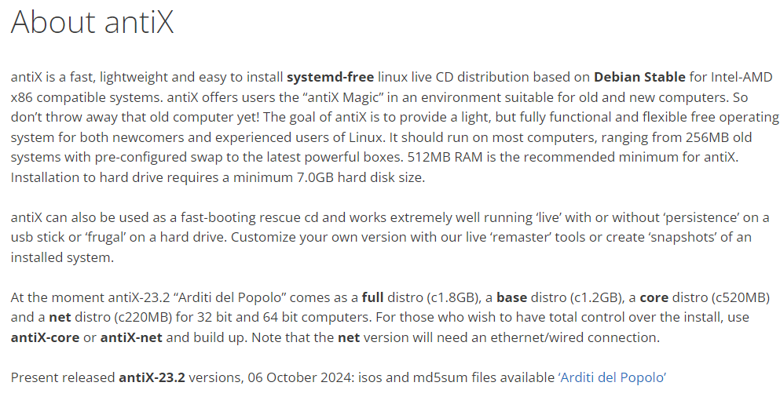

# Sistema instalado · Evidencia final

## Distribución finalmente instalada
- Nombre: antiX Linux
- Versión: 26.1
- Entorno de escritorio: 
- Arquitectura: 64 Bits

## Evidencias obligatorias
- Foto o captura de la pantalla de inicio de sesión:

- Foto o captura del escritorio o entorno ya iniciado:

- Foto o captura de información básica del sistema:

## Estado del equipo al finalizar
- ¿Arranca sin el USB? Si
- ¿Se ve estable el sistema? Si
- ¿Hubo que reiniciar varias veces? No

## Valoración final de la instalación

Considero que la instalación se ha completado con éxito porque el sistema es capaz de funcionar de manera totalmente autónoma, sin depender de un medio Live USB. Los archivos del sistema se han copiado y configurado adecuadamente en el disco principal, el entorno gráfico inicia sin errores, y el equipo se encuentra listo y estable para el uso diario.
