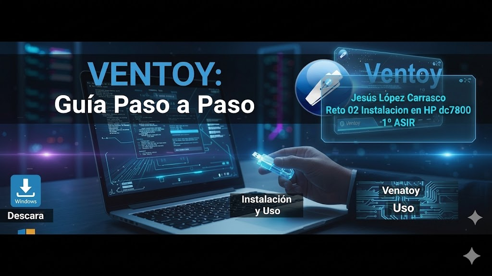

# ENTREGA ÚNICA · Reto 02

## 1. Portada

- Alumno/a: Jesús López Carrasco
- Grupo: Grupo 4
- Curso: 1º ASIR
- Fecha: 21/04/2026

## 2. Introducción

Este documento detalla la creación de un USB de arranque múltiple con Ventoy y la posterior instalación de una distribución Linux en un equipo físico HP Compaq dc7800. El informe registra paso a paso el proceso, el uso de tres imágenes ISO como alternativas y la resolución de las incidencias técnicas encontradas hasta lograr que el sistema quede totalmente operativo.

## 3. Preparación del USB con Ventoy

### 3.1 Datos del pendrive
- Marca y modelo: Philips
- Capacidad: 16 GB

### 3.2 Preparación de Ventoy

Simplemente se instalo el instalador de ventoy, se ejecuto el .exe y se selecciono en el usb donde se queria instalar, una vez hecho eso solo hay que meter las ISOS dentro del USB.

### 3.3 Relación de ISOs en el USB
- ISO 01: antiX Linux
- ISO 02: Puppy Linux
- ISO 03: Tiny Core Linux

### 3.4 Evidencias
- Captura del contenido del USB:

- Captura del menú de Ventoy:

## 4. Plan de instalación

### 4.1 Orden previsto de intento

- Primera opción: antiX Linux
- Segunda opción: Puppy Linux
- Tercera opción: Tiny Core Linux

### 4.2 Criterios para cambiar de ISO

Fallo de arranque: La ISO no inicia desde Ventoy (pantalla negra o kernel panic).

Bloqueo: El instalador se congela y no permite avanzar.

Problemas de hardware: No se detecta el disco duro para particionar.

Error de instalación: Fallos al escribir en el disco o al instalar el gestor de arranque (GRUB).

Fallo post-instalación: El equipo no arranca desde el disco duro una vez finalizado el proceso.

## 5. Desarrollo de la instalación en el HP Compaq dc7800

### 5.1 Arranque desde USB
- Método o tecla usada: F9
- ¿Se detectó correctamente el USB? Si
- ¿Ventoy arrancó? Si

### 5.2 Intento con ISO 01
- ¿Arrancó? Si
- ¿Entró al instalador? Si
- ¿Terminó la instalación? Si
- ¿Hubo que cambiar de ISO? No
- Problemas: Ninguno
- Capturas:

## 6. Sistema finalmente instalado

- Distribución: antiX Linux
- Versión: 26.1
- ¿Arranca sin el USB? Si
- Evidencias del sistema instalado:

## 7. Problemas encontrados y soluciones aplicadas

## Incidencia 1
- Descripción: El ordenador no encendía o se apagaba de forma repentina debido a un exceso de consumo energético.
- Cuándo apareció: Al intentar encender el equipo por primera vez, antes de poder iniciar la instalación.
- Posible causa: La fuente de alimentación no tenía la capacidad suficiente (vatios) para soportar todo el hardware conectado.
- Solución aplicada: Se desconectaron y retiraron 3 tarjetas de expansión que no eran estrictamente necesarias para el equipo.
- Resultado: El consumo de energía disminuyó y el PC logró arrancar y mantenerse encendido de forma estable.

## Incidencia 2
- Descripción: El equipo presentaba errores de lectura de hardware y el sistema no detectaba ninguna unidad de almacenamiento para la instalación.
- Cuándo apareció: Durante las comprobaciones iniciales de arranque (POST) y al llegar a la fase de particionado de discos.
- Posible causa: Un mal ensamblaje físico; los módulos de RAM no estaban bien encajados en sus ranuras y los cables del disco duro estaban sueltos o sin conectar.
- Solución aplicada: Se abrió el equipo, se volvieron a asentar correctamente los módulos de memoria RAM y se conectaron los cables de datos (SATA) y de alimentación al disco duro.
- Resultado: La BIOS reconoció la totalidad de la memoria RAM y el disco duro apareció visible y listo para ser utilizado por el instalador.

## Incidencia 3
- Descripción: La pantalla se quedaba completamente en negro y el sistema se congelaba al intentar arrancar el instalador desde el pendrive.
- Cuándo apareció: Justo después de seleccionar el USB en el menú de arranque
- Posible causa: Muerte del PC
- Solución aplicada: Intentar la instlacion en otro PC
- Resultado: Correcto

## 8. Conclusión final

Finalmente se instaló antiX Linux. Fue la elegida definitiva por ser una distribución extremadamente ligera, lo que permitió que el equipo funcionara con fluidez a pesar de sus limitaciones y de los múltiples problemas de hardware encontrados durante la práctica.

Este proceso nos ha enseñado que revisar físicamente el hardware (RAM, discos y fuente de alimentación) es un paso previo vital, ya que muchos errores de instalación no son de software. Además, hemos comprobado que el ecosistema Linux es ideal para darle una segunda vida a equipos con muy pocos recursos.

## 9. Bibliografía

- [Ventoy](https://www.ventoy.net/)
- [antiX Linux](https://antixlinux.com/about/)
- [Puppy Linux](https://puppylinux-woof-ce.github.io/)
- [Tiny Core Linux](http://tinycorelinux.net/faq.html)
